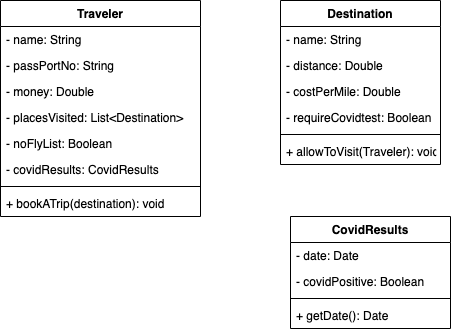

# OOP Practice

## Travler
* The traveler will try and book a Trip ,  by refering to a destination
* If the traveler is rejected you should throw a TravelRejectionException

## Destination
* When the travler request to travel there, calculate the distance multiplied by cost per mile, and see if the Traveler has enough money. If the Travler does not, throw a InsufficientFundsException.
* Check to see if the travler is on the noFlyList, if they are throw a NoFlyListException
* Check to see if the travler is covid free, if they are not throw a InfectionException.
* Check to see the dated of the covid test, if it is greater than three days from current date, throw a InfectTestDateException.

